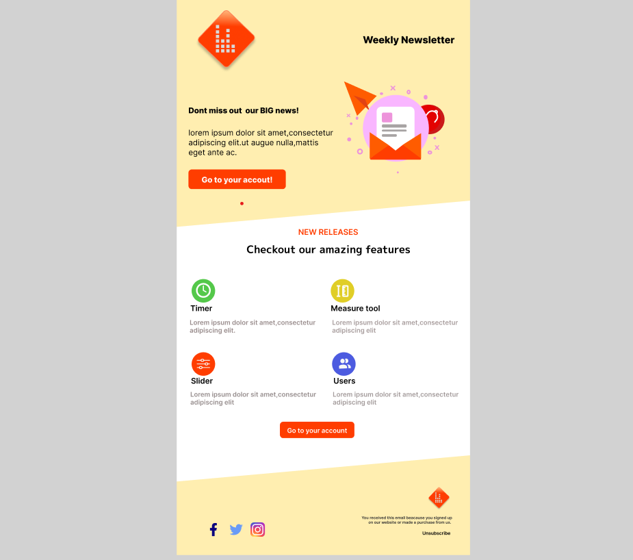
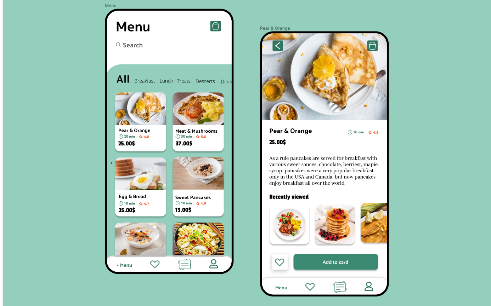
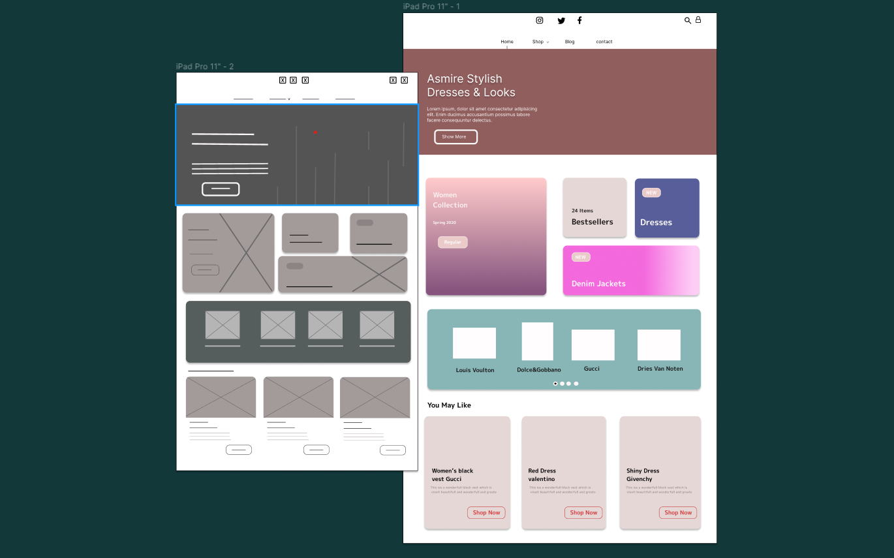

CODESOFT TASK--1
# UI/UX Design Task 1

# UI/UX Design Task 1

This repository contains the UI/UX design for a login and sign-up flow created using Figma.

## Design Overview
Welcome to the UI/UX design project for a modern login and sign-up flow, developed using Figma. This project focuses on creating a seamless and intuitive user experience for onboarding new users and allowing existing users to access the app effortlessly. The design employs a user-centered approach to ensure that the process is both visually appealing and user-friendly.

## Design Screenshots

## Tools Used

- Figma: [Link to Figma](https://www.figma.com/file/gUUh1Hs0lzlBDhHtNJfptk/CodSoft-Task1?type=design&t=hyD1DfclpJ5inexf-6)
- The design was created using Figma, a versatile design and prototyping tool. Figma's collaborative features allowed for efficient teamwork and iterative design improvements.

- CODESOFT TASK--2
# UI-UX-Design-Task-2
This provides a comprehensive look at the content and purpose of your weekly newsletter, showcasing the excitement of new features while emphasizing user engagement and customization.
## Design Screenshots

Figma: [Link to Figma](https://www.figma.com/file/r68cdp9GklDpES8gUsu3Pz/CodSoft-Task-2?type=design&node-id=0-1&mode=design&t=z6SWnIqJzPpTVBZ2-0)

CODESOFT TASK--3

# UI-UX-Design-Task-3
Explore a Culinary Journey and Featured Delights

## Design Screenshots

- Figma: [Link to Figma](https://www.figma.com/file/A6kaimWHJ9612IbYGlM4Wm/CODSOFT-TASK-3?type=design&t=hyD1DfclpJ5inexf-6)

CODESOFT TASK--3
# UI-UX-Design-Task-4
UI/UX design Figma.

## Design Screenshots

Figma: [Link to Figma](https://www.figma.com/file/mfEtVWmblHnBRFGiMrAZss/CodSoft-Task-4?type=design&t=hyD1DfclpJ5inexf-6)

## Key Features
The design encompasses the following key features:

- Welcome Screen: Users are greeted with a welcoming screen that sets the tone for their interaction with the app.

- Sign-Up Process: New users are guided through a step-by-step sign-up process, allowing them to create an account seamlessly.

- Login Options: Existing users have the option to log in using their email or via social networks, ensuring accessibility and flexibility.

- Password Recovery: A "Forgot Password?" link provides a straightforward route for users to reset their passwords if needed.

- Visual Consistency: The design maintains a consistent color palette, typography, and visual style across all screens for a cohesive user experience.
